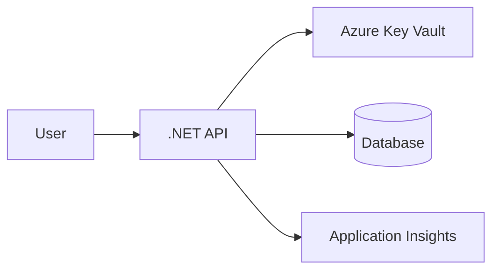
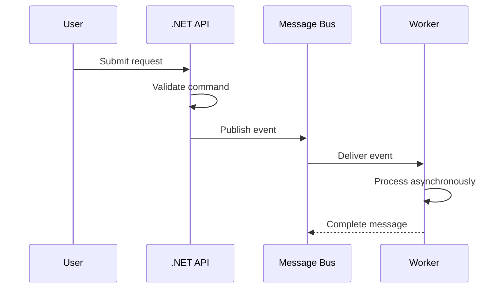
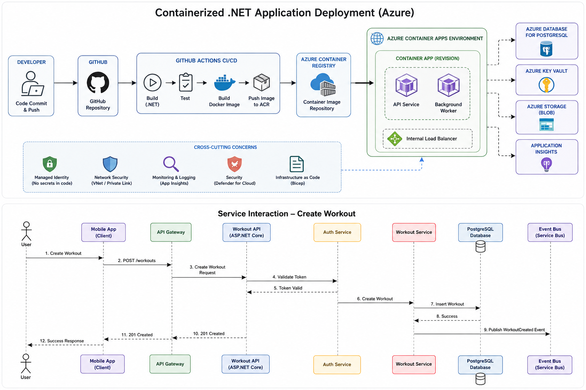

# Markdown Diagram Examples

Use markdown-native diagrams for quick iteration. Move polished or tool-generated diagrams into [images](images/) when needed.

## Mermaid Flowchart



## Mermaid Sequence Diagram



## Simple C4-Style Text Diagram

```text
System Context

[Customer]
    -> uses
[Web Application]
    -> calls
[Orders API]
    -> stores data in
[Orders Database]
    -> publishes events to
[Message Bus]
```

## Referencing PNG or SVG Images

Place exported images in `docs/diagrams/images`.

```markdown


```

